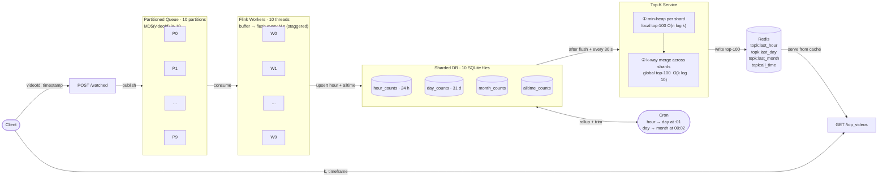

# Top-K Videos API

A real-time API that tracks video view counts and returns the top-K most-watched videos over four timeframes: **last hour**, **last day**, **last month**, and **all time**.

## Architecture



## How it works

**Ingestion** — `POST /watched` publishes a view event to one of 10 in-memory queue partitions, chosen by `MD5(videoId) % 10`. Every video is permanently owned by exactly one partition.

**Aggregation (Flink workers)** — Each partition has a dedicated background worker that drains its queue in micro-batches, accumulates `(videoId, hourBucket) → count` in memory, and flushes to its dedicated SQLite shard every `FLINK_FLUSH_INTERVAL` seconds. Workers are staggered across the flush window so they don't all hit disk at the same moment.

**Storage** — Each shard holds four tables:

| Table | Granularity | Retention |
|---|---|---|
| `hour_counts` | per-hour bucket | 24 hours |
| `day_counts` | per-day bucket | 31 days |
| `month_counts` | per-month bucket | forever |
| `alltime_counts` | running total | forever |

Hourly and daily cron jobs roll up finer-grained data into the coarser tables and trim old rows. `alltime_counts` is updated live on every Flink flush so it never lags.

**Top-K** — After each Flink flush (and every 30 seconds at minimum), the top-K service:
1. Queries each shard independently for its local top-100 using a **min-heap** (`O(n log k)`).
2. **K-way merges** the 10 sorted shard lists into one global top-100 using a max-heap (`O(k log 10)`). No deduplication is needed because consistent hashing guarantees each video lives in exactly one shard.
3. Writes the result to Redis (or an in-memory fallback if Redis isn't running).

**Reads** — `GET /top_videos` returns directly from Redis — no DB touch on the read path.

## API

### `POST /watched`

Record a video view.

```json
{
  "videoId": "abc123",
  "timestamp": "2024-06-01T14:32:00"
}
```

Returns `202 Accepted` immediately. Processing is asynchronous.

### `GET /top_videos`

Return the top-K videos for a timeframe.

| Parameter | Type | Values |
|---|---|---|
| `k` | integer | 1 – 99 |
| `timeframe` | string | `last hour` \| `last day` \| `last month` \| `all time` |

```
GET /top_videos?k=5&timeframe=last+hour
```

```json
{
  "timeframe": "last hour",
  "k": 5,
  "videos": [
    {"video_id": "abc123", "count": 412},
    {"video_id": "xyz789", "count": 389}
  ]
}
```

## Getting started

**Requirements:** Python 3.9+

```bash
git clone https://github.com/tarun-v-batchu/topk-videos
cd topk-videos
pip install -r requirements.txt
```

**Start the server:**

```bash
uvicorn main:app --port 8080
```

Optionally set `FLINK_FLUSH_INTERVAL` (seconds between Flink flushes, default `60`):

```bash
FLINK_FLUSH_INTERVAL=10 uvicorn main:app --port 8080
```

The interactive API docs are at `http://localhost:8080/docs`.

**With Redis** (optional — falls back to in-memory automatically):

```bash
docker run -p 6379:6379 redis:alpine
uvicorn main:app --port 8080
```

## Live demo

`demo.py` starts the server, pumps random view events across 10 video IDs, and renders a live terminal dashboard showing ground-truth send counts, per-shard assignments, and the server's top-K output side-by-side.

```bash
python demo.py                       # 5 events/sec, 10s flush, 3s poll
python demo.py --rate 10 --flush 5  # faster
python demo.py --no-server           # if the server is already running
```

Example output (after ~40 seconds):

```
══════════════════════════════════════════════════════════════════════
  YouTube Top-K Live Demo
  elapsed 39s │ sent 187 events │ next Flink flush ~1s │ next poll ~2s
══════════════════════════════════════════════════════════════════════

  Events sent (ground truth)                    shard
  ▲ vid_1        15  ( 8.0%)  ████████████████░░░░░░░░░░░░░░  #1
  ▲ vid_2        28  (15.0%)  ██████████████████████████████  #2
    vid_3        19  (10.2%)  ████████████████████░░░░░░░░░░  #9
    ...

  Server top-10 'last hour'  (Redis ← k-way shard merge)
  #1   vid_4        25  ██████████████████████████████  shard#0  +3 unflushed
  #2   vid_2        20  ████████████████████████░░░░░░  shard#2  +8 unflushed
  #3   vid_10       15  ██████████████████░░░░░░░░░░░░  shard#7  +4 unflushed
    ...

  Shard → video mapping
  shard 0  vid_4                     local total: 28
  shard 3  vid_6, vid_7              local total: 38
    ...
```

The `+N unflushed` column shows how many events are still buffered in the Flink worker — they'll appear on the server side at the next flush.

## Project structure

```
main.py          FastAPI app — two endpoints + server lifecycle
kafka_queue.py   Partitioned in-memory queue (simulates Kafka)
flink_worker.py  Background aggregation workers (simulates Flink)
db.py            Sharded SQLite storage + rollup logic
topk_service.py  Min-heap top-k + k-way merge across shards
redis_store.py   Redis client with in-memory fallback
scheduler.py     Hourly/daily cron rollups + periodic cache refresh
demo.py          Live terminal dashboard
```
